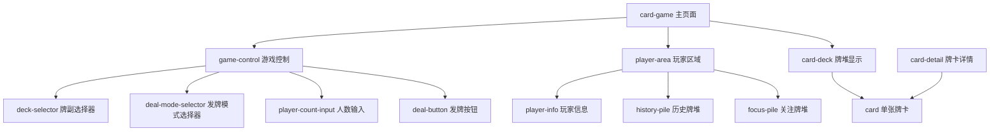
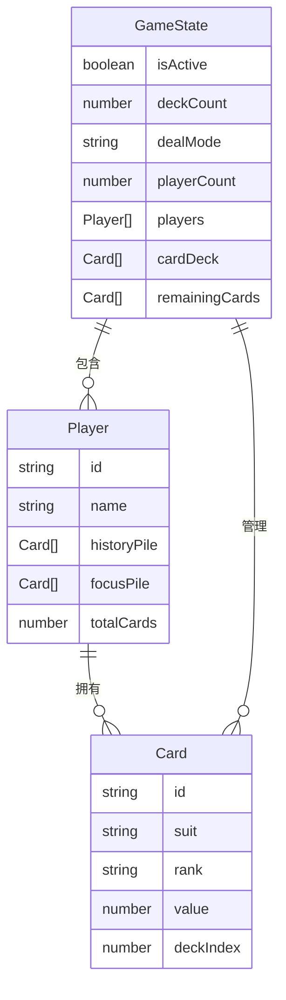

# 扑克牌发牌功能设计文档

## 1. 概述

本文档描述了在微信小程序中实现扑克牌发牌功能的设计方案。该功能允许用户选择使用1副或2副扑克牌进行发牌，支持直接发牌和按人数分配发牌两种模式。每位玩家拥有历史牌堆和关注牌堆两个独立的牌堆管理区域。

### 核心功能
- 扑克牌组管理（1副牌/2副牌）
- 发牌模式选择（直接发牌/按人数发牌）
- 双牌堆系统（历史牌堆/关注牌堆）
- 牌卡交互操作（双击移动/移除）

## 2. 技术栈与依赖

### 基础技术栈
- **框架**: 微信小程序原生框架
- **语言**: TypeScript (ES2020)
- **样式**: Sass/SCSS
- **状态管理**: 页面级状态管理 + 全局数据共享

### 项目结构集成
```
miniprogram/
├── pages/
│   ├── card-game/           # 发牌游戏主页面
│   │   ├── card-game.json
│   │   ├── card-game.scss
│   │   ├── card-game.ts
│   │   └── card-game.wxml
│   └── player-detail/       # 玩家牌堆详情页
│       ├── player-detail.json
│       ├── player-detail.scss
│       ├── player-detail.ts
│       └── player-detail.wxml
├── components/
│   ├── card-deck/           # 扑克牌组件
│   ├── player-area/         # 玩家区域组件
│   └── game-control/        # 游戏控制组件
└── utils/
    ├── card-utils.ts        # 扑克牌工具类
    └── game-manager.ts      # 游戏管理器
```

## 3. 组件架构

### 3.1 组件层次结构



### 3.2 核心组件定义

#### CardGame 主页面组件
数据属性：
- `deckCount`: 牌副数量 (1|2)
- `dealMode`: 发牌模式 ('direct'|'by-player')
- `playerCount`: 玩家数量
- `players`: 玩家列表
- `remainingCards`: 剩余牌堆

方法：
- `onDeckCountChange()`: 牌副数量变更
- `dealCard()`: 发牌操作
- `resetGame()`: 重置游戏

#### PlayerArea 玩家区域组件
属性：
- `player`: 玩家对象
- `index`: 玩家索引

事件：
- `onHistoryCardDoubleClick()`: 历史牌双击
- `onFocusCardDoubleClick()`: 关注牌双击

#### Card 扑克牌组件
属性：
- `suit`: 花色 (spades|hearts|diamonds|clubs)
- `rank`: 牌面值 (A,2-10,J,Q,K)
- `isVisible`: 是否可见

### 3.3 数据模型

#### 扑克牌数据模型


## 4. 路由与导航

### 4.1 页面路由结构

需要在 `app.json` 中添加新页面注册：
- `pages/card-game/card-game` - 发牌游戏主页
- `pages/player-detail/player-detail` - 玩家详情页

### 4.2 页面跳转逻辑

| 路由 | 说明 | 参数 |
|------|------|------|
| `/pages/card-game/card-game` | 主页 → 游戏页面 | - |
| `/pages/player-detail/player-detail` | 游戏页面 → 玩家详情 | `playerId` |
| `wx.navigateBack()` | 返回上一页 | - |

## 5. 样式设计策略

### 5.1 设计系统

#### 色彩方案
- 主色调：#1976d2 (蓝色)
- 红色系（红桃/方块）：#dc004e
- 黑色系（黑桃/梅花）：#000000
- 背景色：#f5f5f5
- 卡牌背景：#ffffff

#### 间距系统
- xs: 4px
- sm: 8px  
- md: 16px (标准间距)
- lg: 24px
- xl: 32px

### 5.2 组件样式架构

#### 卡牌样式设计
- 尺寸：60px × 84px
- 圆角：6px
- 阴影：box-shadow 增加层次感
- 颜色：黑桃黑色，红桃方块红色
- 交互：点击缩放效果

#### 玩家区域样式
- 背景：白色卡片样式
- 布局：Flex 横向布局，左右分别为历史牌堆和关注牌堆
- 间距：使用 16px 标准间距
- 牌堆区域：灰色背景，最小高度 90px

## 6. 状态管理

### 6.1 页面级状态管理
使用小程序原生`Page.data`进行状态管理，通过`setData`方法更新界面数据。

### 6.2 全局数据共享
使用单例模式的`GameManager`类进行跨页面数据共享，支持状态订阅和通知机制。

### 6.3 数据持久化
使用微信小程序`wx.setStorageSync/wx.getStorageSync`进行本地数据存储，确保游戏状态在应用重启后仍能保持。

## 7. API集成层

### 7.1 本地存储管理

| 功能 | 方法 | 说明 |
|------|------|------|
| 保存游戏状态 | `saveGameState()` | 将当前游戏状态存储到本地 |
| 加载游戏状态 | `loadGameState()` | 从本地加载上次游戏状态 |
| 保存玩家历史 | `savePlayerHistory()` | 存储玩家牌堆历史数据 |
| 加载玩家历史 | `loadPlayerHistory()` | 加载玩家历史数据 |
| 清除所有数据 | `clearAllData()` | 重置游戏，清除全部本地数据 |

### 7.2 游戏逻辑API

#### 扑克牌工具类

| 功能 | 输入 | 输出 | 说明 |
|------|------|------|------|
| 创建牌堆 | `deckIndex: number` | `Card[]` | 生成标准52张扑克牌 |
| 洗牌 | `deck: Card[]` | `Card[]` | 随机打乱牌堆顺序 |
| 发单张牌 | `deck: Card[]` | `{card, remainingDeck}` | 从牌堆顶部发出一张牌 |
| 按人数分牌 | `deck: Card[], playerCount: number` | `{playerCards, remainingDeck}` | 将牌堆平均分配给多个玩家 |

## 8. 测试策略

### 8.1 单元测试重点
- 扑克牌工具类功能验证（创建牌堆、洗牌、发牌逻辑）
- 游戏状态管理器的状态更新和数据同步
- 本地存储的数据保存和加载功能

### 8.2 功能测试场景
- 发牌模式切换和牌堆管理
- 双击交互（历史牌堆→关注牌堆，关注牌堆移除）
- 跨页面状态同步和数据持久化
- 边界情况处理（牌堆耗尽、无效操作等）